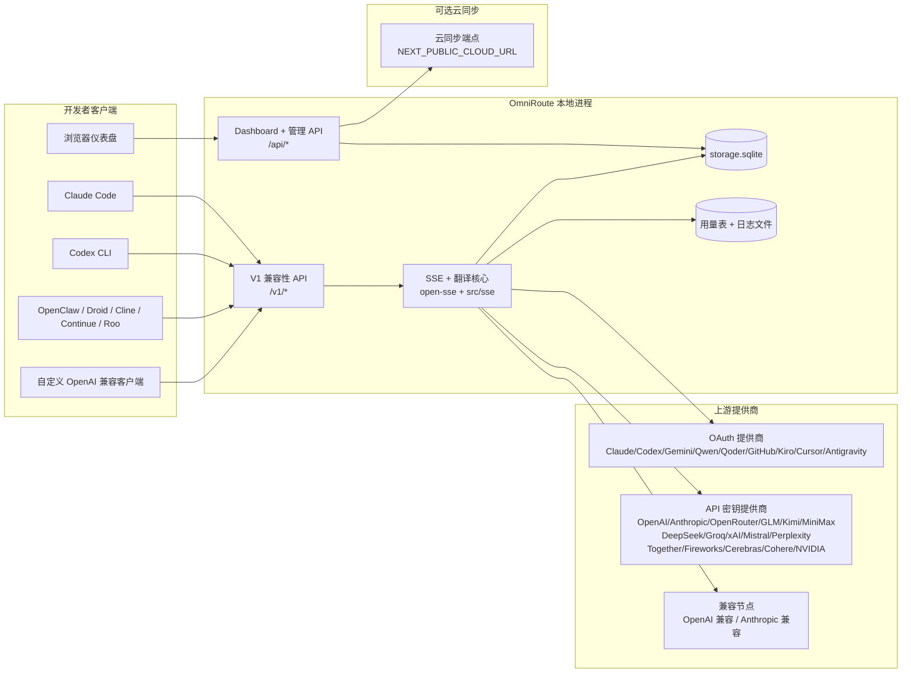
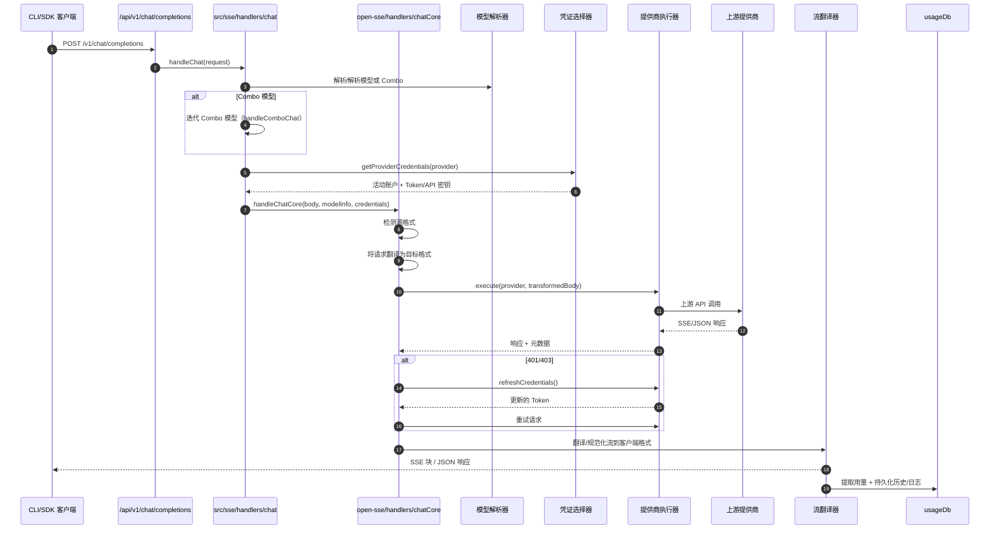
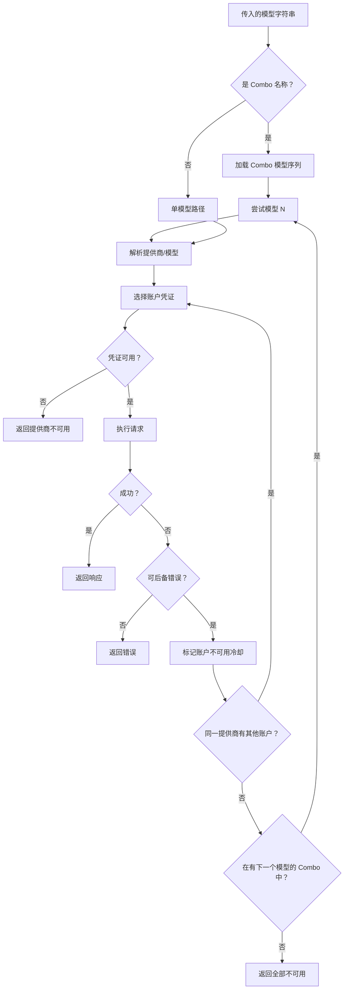
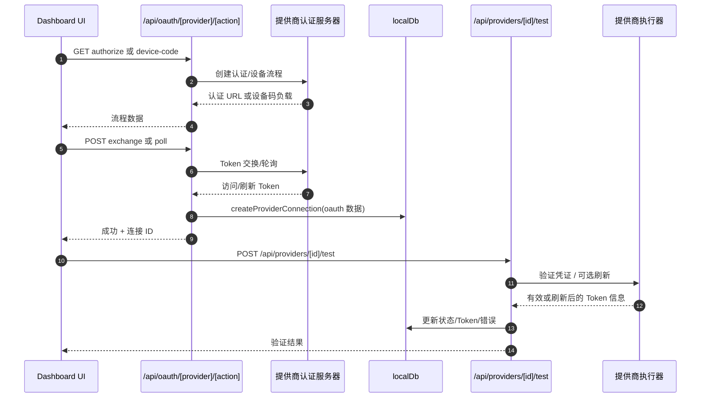
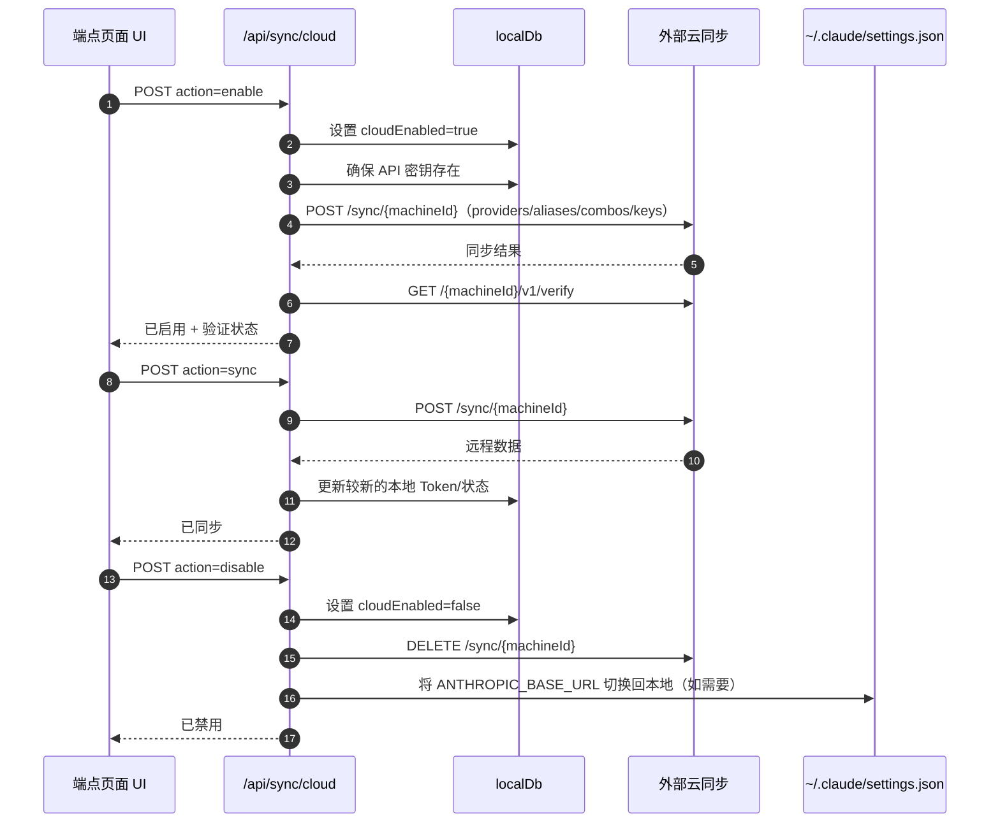
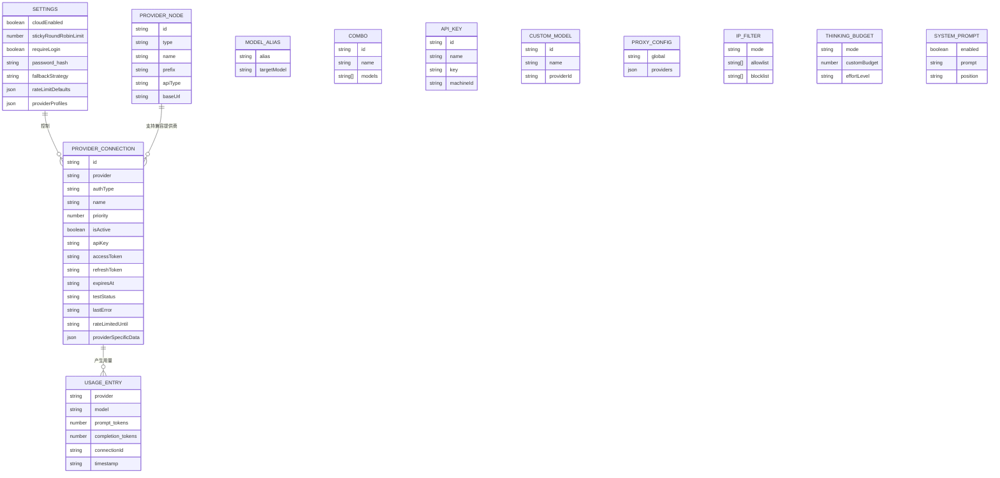
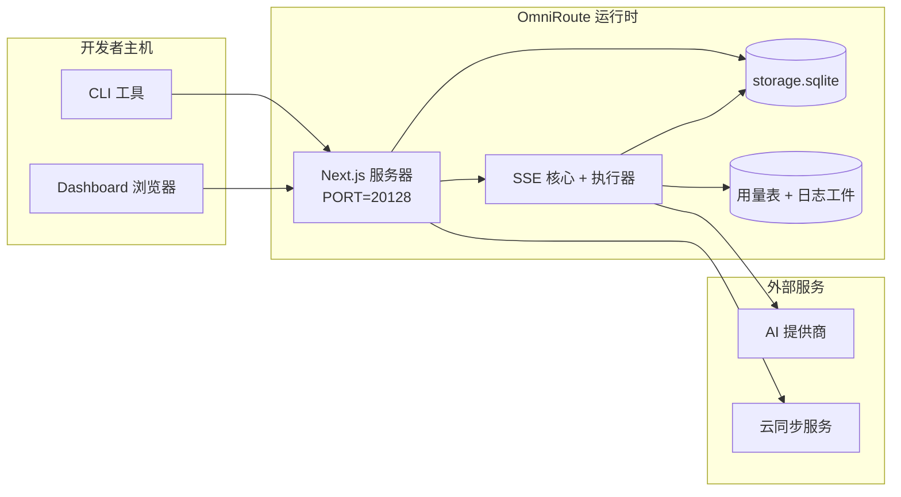

# OmniRoute 架构

🌐 **语言:** 🇺🇸 [English](../../ARCHITECTURE.md) | 🇧🇷 [Português (Brasil)](../pt-BR/ARCHITECTURE.md) | 🇪🇸 [Español](../es/ARCHITECTURE.md) | 🇫🇷 [Français](../fr/ARCHITECTURE.md) | 🇮🇹 [Italiano](../it/ARCHITECTURE.md) | 🇷🇺 [Русский](../ru/ARCHITECTURE.md) | 🇨🇳 [中文 (简体)](../zh-CN/ARCHITECTURE.md) | 🇩🇪 [Deutsch](../de/ARCHITECTURE.md) | 🇮🇳 [हिन्दी](../in/ARCHITECTURE.md) | 🇹🇭 [ไทย](../th/ARCHITECTURE.md) | 🇺🇦 [Українська](../uk-UA/ARCHITECTURE.md) | 🇸🇦 [العربية](../ar/ARCHITECTURE.md) | 🇯🇵 [日本語](../ja/ARCHITECTURE.md) | 🇻🇳 [Tiếng Việt](../vi/ARCHITECTURE.md) | 🇧🇬 [Български](../bg/ARCHITECTURE.md) | 🇩🇰 [Dansk](../da/ARCHITECTURE.md) | 🇫🇮 [Suomi](../fi/ARCHITECTURE.md) | 🇮🇱 [עברית](../he/ARCHITECTURE.md) | 🇭🇺 [Magyar](../hu/ARCHITECTURE.md) | 🇮🇩 [Bahasa Indonesia](../id/ARCHITECTURE.md) | 🇰🇷 [한국어](../ko/ARCHITECTURE.md) | 🇲🇾 [Bahasa Melayu](../ms/ARCHITECTURE.md) | 🇳🇱 [Nederlands](../nl/ARCHITECTURE.md) | 🇳🇴 [Norsk](../no/ARCHITECTURE.md) | 🇵🇹 [Português (Portugal)](../pt/ARCHITECTURE.md) | 🇷🇴 [Română](../ro/ARCHITECTURE.md) | 🇵🇱 [Polski](../pl/ARCHITECTURE.md) | 🇸🇰 [Slovenčina](../sk/ARCHITECTURE.md) | 🇸🇪 [Svenska](../sv/ARCHITECTURE.md) | 🇵🇭 [Filipino](../phi/ARCHITECTURE.md) | 🇨🇿 [Čeština](../cs/ARCHITECTURE.md)

_最后更新：2026-03-28_

## 概述

OmniRoute 是一个基于 Next.js 构建的本地 AI 路由网关和仪表盘。
它提供单一的 OpenAI 兼容端点（`/v1/*`），并将流量路由到多个上游提供商，支持翻译、后备、Token 刷新和用量追踪。

核心能力：

- 面向 CLI/工具的 OpenAI 兼容 API 接口（28 个提供商）
- 跨提供商格式的请求/响应翻译
- 模型 Combo 后备（多模型序列）
- 账户级后备（每个提供商多账户）
- OAuth + API 密钥提供商连接管理
- 通过 `/v1/embeddings` 生成 Embedding（6 个提供商，9 个模型）
- 通过 `/v1/images/generations` 生成图像（4 个提供商，9 个模型）
- Think 标签解析（`<think>...</think>`）用于推理模型
- 响应清理以实现严格的 OpenAI SDK 兼容性
- 角色规范化（developer→system，system→user）实现跨提供商兼容
- 结构化输出转换（json_schema → Gemini responseSchema）
- 本地持久化：提供商、密钥、别名、Combo、设置、定价
- 用量/成本追踪和请求日志
- 可选的云同步用于多设备/状态同步
- API 访问控制的 IP 白名单/黑名单
- Thinking 预算管理（passthrough/auto/custom/adaptive）
- 全局系统提示词注入
- 会话追踪和指纹识别
- 每账户增强速率限制，支持提供商特定配置文件
- 提供商弹性的熔断器模式
- 使用互斥锁的防惊群保护
- 基于签名的请求去重缓存
- 领域层：模型可用性、成本规则、后备策略、锁定策略
- 领域状态持久化（SQLite 写入缓存用于后备、预算、锁定、熔断器）
- 集中请求评估的策略引擎（锁定 → 预算 → 后备）
- 请求遥测，支持 p50/p95/p99 延迟聚合
- 关联 ID（X-Request-Id）用于端到端追踪
- 合规审计日志，支持按 API 密钥选择退出
- 用于 LLM 质量保证的评估框架
- 实时熔断器状态的弹性 UI 仪表盘
- 模块化 OAuth 提供商（`src/lib/oauth/providers/` 下的 12 个独立模块）

主要运行时模型：

- `src/app/api/*` 下的 Next.js app routes 同时实现 Dashboard API 和兼容性 API
- `src/sse/*` + `open-sse/*` 中的共享 SSE/路由核心处理提供商执行、翻译、流式传输、后备和用量

## 范围与边界

### 范围内

- 本地网关运行时
- Dashboard 管理 API
- 提供商认证和 Token 刷新
- 请求翻译和 SSE 流式传输
- 本地状态 + 用量持久化
- 可选的云同步编排

### 范围外

- `NEXT_PUBLIC_CLOUD_URL` 后面的云服务实现
- 本地进程之外的提供商 SLA/控制平面
- 外部 CLI 二进制文件本身（Claude CLI、Codex CLI 等）

## Dashboard 界面（当前）

`src/app/(dashboard)/dashboard/` 下的主要页面：

- `/dashboard` — 快速入门 + 服务商概览
- `/dashboard/endpoint` — 端点代理 + MCP + A2A + API 端点标签页
- `/dashboard/providers` — 服务商连接和凭证
- `/dashboard/combos` — Combo 策略、模板、模型路由规则
- `/dashboard/costs` — 成本汇总和定价可见性
- `/dashboard/analytics` — 使用分析和评估
- `/dashboard/limits` — 配额/速率控制
- `/dashboard/cli-tools` — CLI 引导、运行时检测、配置生成
- `/dashboard/agents` — 检测到的 ACP 代理 + 自定义代理注册
- `/dashboard/media` — 图像/视频/音乐 playground
- `/dashboard/search-tools` — 搜索服务商测试和历史
- `/dashboard/health` — 正常运行时间、熔断器、速率限制
- `/dashboard/logs` — 请求/代理/审计/控制台日志
- `/dashboard/settings` — 系统设置标签页（通用、路由、Combo 默认值等）
- `/dashboard/api-manager` — API 密钥生命周期和模型权限

## 高层系统上下文



## 核心运行时组件

## 1) API 和路由层（Next.js App Routes）

主要目录：

- `src/app/api/v1/*` 和 `src/app/api/v1beta/*` 用于兼容性 API
- `src/app/api/*` 用于管理/配置 API
- `next.config.mjs` 中的 Next 重写将 `/v1/*` 映射到 `/api/v1/*`

重要的兼容性路由：

- `src/app/api/v1/chat/completions/route.ts`
- `src/app/api/v1/messages/route.ts`
- `src/app/api/v1/responses/route.ts`
- `src/app/api/v1/models/route.ts` — 包含 `custom: true` 的自定义模型
- `src/app/api/v1/embeddings/route.ts` — Embedding 生成（6 个提供商）
- `src/app/api/v1/images/generations/route.ts` — 图像生成（4+ 个提供商，包括 Antigravity/Nebius）
- `src/app/api/v1/messages/count_tokens/route.ts`
- `src/app/api/v1/providers/[provider]/chat/completions/route.ts` — 专用的每提供商聊天
- `src/app/api/v1/providers/[provider]/embeddings/route.ts` — 专用的每提供商 Embedding
- `src/app/api/v1/providers/[provider]/images/generations/route.ts` — 专用的每提供商图像
- `src/app/api/v1beta/models/route.ts`
- `src/app/api/v1beta/models/[...path]/route.ts`

管理领域：

- 认证/设置：`src/app/api/auth/*`、`src/app/api/settings/*`
- 提供商/连接：`src/app/api/providers*`
- 提供商节点：`src/app/api/provider-nodes*`
- 自定义模型：`src/app/api/provider-models`（GET/POST/DELETE）
- 模型目录：`src/app/api/models/route.ts`（GET）
- 代理配置：`src/app/api/settings/proxy`（GET/PUT/DELETE）+ `src/app/api/settings/proxy/test`（POST）
- OAuth：`src/app/api/oauth/*`
- 密钥/别名/Combo/定价：`src/app/api/keys*`、`src/app/api/models/alias`、`src/app/api/combos*`、`src/app/api/pricing`
- 用量：`src/app/api/usage/*`
- 同步/云：`src/app/api/sync/*`、`src/app/api/cloud/*`
- CLI 工具助手：`src/app/api/cli-tools/*`
- IP 过滤：`src/app/api/settings/ip-filter`（GET/PUT）
- Thinking 预算：`src/app/api/settings/thinking-budget`（GET/PUT）
- 系统提示词：`src/app/api/settings/system-prompt`（GET/PUT）
- 会话：`src/app/api/sessions`（GET）
- 速率限制：`src/app/api/rate-limits`（GET）
- 弹性：`src/app/api/resilience`（GET/PATCH）— 提供商配置文件、熔断器、速率限制状态
- 弹性重置：`src/app/api/resilience/reset`（POST）— 重置熔断器 + 冷却
- 缓存统计：`src/app/api/cache/stats`（GET/DELETE）
- 模型可用性：`src/app/api/models/availability`（GET/POST）
- 遥测：`src/app/api/telemetry/summary`（GET）
- 预算：`src/app/api/usage/budget`（GET/POST）
- 后备链：`src/app/api/fallback/chains`（GET/POST/DELETE）
- 合规审计：`src/app/api/compliance/audit-log`（GET）
- 评估：`src/app/api/evals`（GET/POST）、`src/app/api/evals/[suiteId]`（GET）
- 策略：`src/app/api/policies`（GET/POST）

## 2) SSE + 翻译核心

主要流程模块：

- 入口：`src/sse/handlers/chat.ts`
- 核心编排：`open-sse/handlers/chatCore.ts`
- 提供商执行适配器：`open-sse/executors/*`
- 格式检测/提供商配置：`open-sse/services/provider.ts`
- 模型解析/解析：`src/sse/services/model.ts`、`open-sse/services/model.ts`
- 账户后备逻辑：`open-sse/services/accountFallback.ts`
- 翻译注册表：`open-sse/translator/index.ts`
- 流转换：`open-sse/utils/stream.ts`、`open-sse/utils/streamHandler.ts`
- 用量提取/规范化：`open-sse/utils/usageTracking.ts`
- Think 标签解析器：`open-sse/utils/thinkTagParser.ts`
- Embedding 处理器：`open-sse/handlers/embeddings.ts`
- Embedding 提供商注册表：`open-sse/config/embeddingRegistry.ts`
- 图像生成处理器：`open-sse/handlers/imageGeneration.ts`
- 图像提供商注册表：`open-sse/config/imageRegistry.ts`
- 响应清理：`open-sse/handlers/responseSanitizer.ts`
- 角色规范化：`open-sse/services/roleNormalizer.ts`

服务（业务逻辑）：

- 账户选择/评分：`open-sse/services/accountSelector.ts`
- 上下文生命周期管理：`open-sse/services/contextManager.ts`
- IP 过滤执行：`open-sse/services/ipFilter.ts`
- 会话追踪：`open-sse/services/sessionManager.ts`
- 请求去重：`open-sse/services/signatureCache.ts`
- 系统提示词注入：`open-sse/services/systemPrompt.ts`
- Thinking 预算管理：`open-sse/services/thinkingBudget.ts`
- 通配符模型路由：`open-sse/services/wildcardRouter.ts`
- 速率限制管理：`open-sse/services/rateLimitManager.ts`
- 熔断器：`open-sse/services/circuitBreaker.ts`

领域层模块：

- 模型可用性：`src/lib/domain/modelAvailability.ts`
- 成本规则/预算：`src/lib/domain/costRules.ts`
- 后备策略：`src/lib/domain/fallbackPolicy.ts`
- Combo 解析器：`src/lib/domain/comboResolver.ts`
- 锁定策略：`src/lib/domain/lockoutPolicy.ts`
- 策略引擎：`src/domain/policyEngine.ts` — 集中的锁定 → 预算 → 后备评估
- 错误码目录：`src/lib/domain/errorCodes.ts`
- 请求 ID：`src/lib/domain/requestId.ts`
- Fetch 超时：`src/lib/domain/fetchTimeout.ts`
- 请求遥测：`src/lib/domain/requestTelemetry.ts`
- 合规/审计：`src/lib/domain/compliance/index.ts`
- 评估运行器：`src/lib/domain/evalRunner.ts`
- 领域状态持久化：`src/lib/db/domainState.ts` — 后备链、预算、成本历史、锁定状态、熔断器的 SQLite CRUD

OAuth 提供商模块（`src/lib/oauth/providers/` 下的 12 个独立文件）：

- 注册表索引：`src/lib/oauth/providers/index.ts`
- 独立提供商：`claude.ts`、`codex.ts`、`gemini.ts`、`antigravity.ts`、`qoder.ts`、`qwen.ts`、`kimi-coding.ts`、`github.ts`、`kiro.ts`、`cursor.ts`、`kilocode.ts`、`cline.ts`
- 薄包装器：`src/lib/oauth/providers.ts` — 从独立模块重新导出

## 3) 持久化层

主要状态数据库（SQLite）：

- 核心基础设施：`src/lib/db/core.ts`（better-sqlite3、迁移、WAL）
- 重新导出外观：`src/lib/localDb.ts`（面向调用者的薄兼容层）
- 文件：`${DATA_DIR}/storage.sqlite`（或设置 `$XDG_CONFIG_HOME/omniroute/storage.sqlite` 时使用该路径，否则为 `~/.omniroute/storage.sqlite`）
- 实体（表 + KV 命名空间）：providerConnections、providerNodes、modelAliases、combos、apiKeys、settings、pricing、**customModels**、**proxyConfig**、**ipFilter**、**thinkingBudget**、**systemPrompt**

用量持久化：

- 外观：`src/lib/usageDb.ts`（分解模块在 `src/lib/usage/*`）
- `storage.sqlite` 中的 SQLite 表：`usage_history`、`call_logs`、`proxy_logs`
- 可选的文件工件为兼容性/调试保留（`${DATA_DIR}/log.txt`、`${DATA_DIR}/call_logs/`、`<repo>/logs/...`）
- 旧版 JSON 文件在启动迁移时会被迁移到 SQLite

领域状态数据库（SQLite）：

- `src/lib/db/domainState.ts` — 领域状态的 CRUD 操作
- 表（在 `src/lib/db/core.ts` 中创建）：`domain_fallback_chains`、`domain_budgets`、`domain_cost_history`、`domain_lockout_state`、`domain_circuit_breakers`
- 写入缓存模式：内存中的 Map 在运行时是权威的；变更同步写入 SQLite；状态在冷启动时从数据库恢复

## 4) 认证 + 安全接口

- Dashboard Cookie 认证：`src/proxy.ts`、`src/app/api/auth/login/route.ts`
- API 密钥生成/验证：`src/shared/utils/apiKey.ts`
- 提供商密钥持久化在 `providerConnections` 条目中
- 通过 `open-sse/utils/proxyFetch.ts`（环境变量）和 `open-sse/utils/networkProxy.ts`（可配置的每提供商或全局）支持出站代理

## 5) 云同步

- 调度器初始化：`src/lib/initCloudSync.ts`、`src/shared/services/initializeCloudSync.ts`、`src/shared/services/modelSyncScheduler.ts`
- 周期性任务：`src/shared/services/cloudSyncScheduler.ts`
- 周期性任务：`src/shared/services/modelSyncScheduler.ts`
- 控制路由：`src/app/api/sync/cloud/route.ts`

## 请求生命周期（`/v1/chat/completions`）



## Combo + 账户后备流程



后备决策由 `open-sse/services/accountFallback.ts` 使用状态码和错误消息启发式驱动。

## OAuth 引导和 Token 刷新生命周期



实时流量期间的刷新在 `open-sse/handlers/chatCore.ts` 内通过执行器 `refreshCredentials()` 执行。

## 云同步生命周期（启用 / 同步 / 禁用）



周期性同步在云启用时由 `CloudSyncScheduler` 触发。

## 数据模型和存储映射



物理存储文件：

- 主运行时数据库：`${DATA_DIR}/storage.sqlite`
- 请求日志行：`${DATA_DIR}/log.txt`（兼容性/调试工件）
- 结构化调用负载归档：`${DATA_DIR}/call_logs/`
- 可选的翻译器/请求调试会话：`<repo>/logs/...`

## 部署拓扑



## 模块映射（关键决策）

### 路由和 API 模块

- `src/app/api/v1/*`、`src/app/api/v1beta/*`：兼容性 API
- `src/app/api/v1/providers/[provider]/*`：专用的每提供商路由（聊天、Embedding、图像）
- `src/app/api/providers*`：提供商 CRUD、验证、测试
- `src/app/api/provider-nodes*`：自定义兼容节点管理
- `src/app/api/provider-models`：自定义模型管理（CRUD）
- `src/app/api/models/route.ts`：模型目录 API（别名 + 自定义模型）
- `src/app/api/oauth/*`：OAuth/设备码流程
- `src/app/api/keys*`：本地 API 密钥生命周期
- `src/app/api/models/alias`：别名管理
- `src/app/api/combos*`：后备 Combo 管理
- `src/app/api/pricing`：成本计算的定价覆盖
- `src/app/api/settings/proxy`：代理配置（GET/PUT/DELETE）
- `src/app/api/settings/proxy/test`：出站代理连接测试（POST）
- `src/app/api/usage/*`：用量和日志 API
- `src/app/api/sync/*` + `src/app/api/cloud/*`：云同步和面向云的助手
- `src/app/api/cli-tools/*`：本地 CLI 配置写入器/检查器
- `src/app/api/settings/ip-filter`：IP 白名单/黑名单（GET/PUT）
- `src/app/api/settings/thinking-budget`：Thinking Token 预算配置（GET/PUT）
- `src/app/api/settings/system-prompt`：全局系统提示词（GET/PUT）
- `src/app/api/sessions`：活动会话列表（GET）
- `src/app/api/rate-limits`：每账户速率限制状态（GET）

### 路由和执行核心

- `src/sse/handlers/chat.ts`：请求解析、Combo 处理、账户选择循环
- `open-sse/handlers/chatCore.ts`：翻译、执行器调度、重试/刷新处理、流设置
- `open-sse/executors/*`：提供商特定的网络和格式行为

### 翻译注册表和格式转换器

- `open-sse/translator/index.ts`：翻译器注册表和编排
- 请求翻译器：`open-sse/translator/request/*`
- 响应翻译器：`open-sse/translator/response/*`
- 格式常量：`open-sse/translator/formats.ts`

### 持久化

- `src/lib/db/*`：SQLite 上的持久化配置/状态和领域持久化
- `src/lib/localDb.ts`：数据库模块的兼容性重新导出
- `src/lib/usageDb.ts`：基于 SQLite 表的用量历史/调用日志外观

## 提供商执行器覆盖（策略模式）

每个提供商都有一个继承自 `BaseExecutor`（在 `open-sse/executors/base.ts` 中）的专用执行器，提供 URL 构建、请求头构造、指数退避重试、凭证刷新钩子和 `execute()` 编排方法。

| 执行器                | 提供商                                                                                                                                                       | 特殊处理                                                             |
| --------------------- | ------------------------------------------------------------------------------------------------------------------------------------------------------------ | -------------------------------------------------------------------- |
| `DefaultExecutor`     | OpenAI、Claude、Gemini、Qwen、Qoder、OpenRouter、GLM、Kimi、MiniMax、DeepSeek、Groq、xAI、Mistral、Perplexity、Together、Fireworks、Cerebras、Cohere、NVIDIA | 每提供商动态 URL/请求头配置                                          |
| `AntigravityExecutor` | Google Antigravity                                                                                                                                           | 自定义项目/会话 ID，Retry-After 解析                                 |
| `CodexExecutor`       | OpenAI Codex                                                                                                                                                 | 注入系统指令，强制推理努力                                           |
| `CursorExecutor`      | Cursor IDE                                                                                                                                                   | ConnectRPC 协议，Protobuf 编码，通过校验和签名请求                   |
| `GithubExecutor`      | GitHub Copilot                                                                                                                                               | Copilot Token 刷新，模拟 VSCode 的请求头                             |
| `KiroExecutor`        | AWS CodeWhisperer/Kiro                                                                                                                                       | AWS EventStream 二进制格式 → SSE 转换                                |
| `GeminiCLIExecutor`   | Gemini CLI                                                                                                                                                   | Google OAuth Token 刷新周期                                          |

所有其他提供商（包括自定义兼容节点）使用 `DefaultExecutor`。

## 提供商兼容性矩阵

| 提供商           | 格式             | 认证                  | 流式传输         | 非流式传输 | Token 刷新 | 用量 API           |
| ---------------- | ---------------- | --------------------- | ---------------- | ---------- | ---------- | ------------------ |
| Claude           | claude           | API 密钥 / OAuth      | ✅               | ✅         | ✅         | ⚠️ 仅管理员       |
| Gemini           | gemini           | API 密钥 / OAuth      | ✅               | ✅         | ✅         | ⚠️ Cloud Console  |
| Gemini CLI       | gemini-cli       | OAuth                 | ✅               | ✅         | ✅         | ⚠️ Cloud Console  |
| Antigravity      | antigravity      | OAuth                 | ✅               | ✅         | ✅         | ✅ 完整配额 API   |
| OpenAI           | openai           | API 密钥              | ✅               | ✅         | ❌         | ❌                 |
| Codex            | openai-responses | OAuth                 | ✅ 强制          | ❌         | ✅         | ✅ 速率限制       |
| GitHub Copilot   | openai           | OAuth + Copilot Token | ✅               | ✅         | ✅         | ✅ 配额快照       |
| Cursor           | cursor           | 自定义校验和          | ✅               | ✅         | ❌         | ❌                 |
| Kiro             | kiro             | AWS SSO OIDC          | ✅ (EventStream) | ❌         | ✅         | ✅ 用量限制       |
| Qwen             | openai           | OAuth                 | ✅               | ✅         | ✅         | ⚠️ 每请求        |
| Qoder            | openai           | OAuth (Basic)         | ✅               | ✅         | ✅         | ⚠️ 每请求        |
| OpenRouter       | openai           | API 密钥              | ✅               | ✅         | ❌         | ❌                 |
| GLM/Kimi/MiniMax | claude           | API 密钥              | ✅               | ✅         | ❌         | ❌                 |
| DeepSeek         | openai           | API 密钥              | ✅               | ✅         | ❌         | ❌                 |
| Groq             | openai           | API 密钥              | ✅               | ✅         | ❌         | ❌                 |
| xAI (Grok)       | openai           | API 密钥              | ✅               | ✅         | ❌         | ❌                 |
| Mistral          | openai           | API 密钥              | ✅               | ✅         | ❌         | ❌                 |
| Perplexity       | openai           | API 密钥              | ✅               | ✅         | ❌         | ❌                 |
| Together AI      | openai           | API 密钥              | ✅               | ✅         | ❌         | ❌                 |
| Fireworks AI     | openai           | API 密钥              | ✅               | ✅         | ❌         | ❌                 |
| Cerebras         | openai           | API 密钥              | ✅               | ✅         | ❌         | ❌                 |
| Cohere           | openai           | API 密钥              | ✅               | ✅         | ❌         | ❌                 |
| NVIDIA NIM       | openai           | API 密钥              | ✅               | ✅         | ❌         | ❌                 |

## 格式翻译覆盖

检测到的源格式包括：

- `openai`
- `openai-responses`
- `claude`
- `gemini`

目标格式包括：

- OpenAI 聊天/Responses
- Claude
- Gemini/Gemini-CLI/Antigravity 封装
- Kiro
- Cursor

翻译使用 **OpenAI 作为中心格式** — 所有转换都通过 OpenAI 作为中介：

```
源格式 → OpenAI（中心）→ 目标格式
```

翻译根据源负载形状和提供商目标格式动态选择。

翻译管道中的额外处理层：

- **响应清理** — 从 OpenAI 格式响应（流式和非流式）中剥离非标准字段，以确保严格的 SDK 合规性
- **角色规范化** — 为非 OpenAI 目标将 `developer` → `system`；为拒绝 system 角色的模型（GLM、ERNIE）合并 `system` → `user`
- **Think 标签提取** — 从内容中解析 `<think>...</think>` 块到 `reasoning_content` 字段
- **结构化输出** — 将 OpenAI `response_format.json_schema` 转换为 Gemini 的 `responseMimeType` + `responseSchema`

## 支持的 API 端点

| 端点                                               | 格式               | 处理器                                               |
| -------------------------------------------------- | ------------------ | ---------------------------------------------------- |
| `POST /v1/chat/completions`                        | OpenAI 聊天        | `src/sse/handlers/chat.ts`                           |
| `POST /v1/messages`                                | Claude Messages    | 相同处理器（自动检测）                               |
| `POST /v1/responses`                               | OpenAI Responses   | `open-sse/handlers/responsesHandler.ts`              |
| `POST /v1/embeddings`                              | OpenAI Embeddings  | `open-sse/handlers/embeddings.ts`                    |
| `GET /v1/embeddings`                               | 模型列表           | API 路由                                             |
| `POST /v1/images/generations`                      | OpenAI Images      | `open-sse/handlers/imageGeneration.ts`               |
| `GET /v1/images/generations`                       | 模型列表           | API 路由                                             |
| `POST /v1/providers/{provider}/chat/completions`   | OpenAI 聊天        | 专用的每提供商，带模型验证                           |
| `POST /v1/providers/{provider}/embeddings`         | OpenAI Embeddings  | 专用的每提供商，带模型验证                           |
| `POST /v1/providers/{provider}/images/generations` | OpenAI Images      | 专用的每提供商，带模型验证                           |
| `POST /v1/messages/count_tokens`                   | Claude Token 计数  | API 路由                                             |
| `GET /v1/models`                                   | OpenAI 模型列表    | API 路由（聊天 + Embedding + 图像 + 自定义模型）     |
| `GET /api/models/catalog`                          | 目录               | 按提供商 + 类型分组的所有模型                        |
| `POST /v1beta/models/*:streamGenerateContent`      | Gemini 原生        | API 路由                                             |
| `GET/PUT/DELETE /api/settings/proxy`               | 代理配置           | 网络代理配置                                         |
| `POST /api/settings/proxy/test`                    | 代理连接           | 代理健康/连接测试端点                                |
| `GET/POST/DELETE /api/provider-models`             | 自定义模型         | 每提供商的自定义模型管理                             |

## Bypass 处理器

Bypass 处理器（`open-sse/utils/bypassHandler.ts`）拦截来自 Claude CLI 的已知"丢弃"请求 — 预热 ping、标题提取和 Token 计数 — 并返回**假响应**而不消耗上游提供商的 Token。这仅在 `User-Agent` 包含 `claude-cli` 时触发。

## 请求日志管道

请求日志器（`open-sse/utils/requestLogger.ts`）提供 7 阶段调试日志管道，默认禁用，通过 `ENABLE_REQUEST_LOGS=true` 启用：

```
1_req_client.json → 2_req_source.json → 3_req_openai.json → 4_req_target.json
→ 5_res_provider.txt → 6_res_openai.txt → 7_res_client.txt
```

文件写入到 `<repo>/logs/<session>/`，每个请求会话一个。

## 故障模式和弹性

## 1) 账户/提供商可用性

- 瞬态/速率/认证错误时的提供商账户冷却
- 请求失败前的账户后备
- 当前模型/提供商路径耗尽时的 Combo 模型后备

## 2) Token 过期

- 可刷新提供商的预检查和带重试的刷新
- 核心路径中刷新尝试后的 401/403 重试

## 3) 流安全

- 断开连接感知的流控制器
- 带流结束刷新和 `[DONE]` 处理的翻译流
- 提供商用量元数据缺失时的用量估算后备

## 4) 云同步降级

- 同步错误会显示但本地运行时继续
- 调度器有重试能力的逻辑，但周期性执行目前默认调用单次尝试同步

## 5) 数据完整性

- 启动时的 SQLite 模式迁移和自动升级钩子
- 旧版 JSON → SQLite 迁移兼容路径

## 可观测性和运营信号

运行时可见性来源：

- 来自 `src/sse/utils/logger.ts` 的控制台日志
- SQLite 中的每请求用量聚合（`usage_history`、`call_logs`、`proxy_logs`）
- 当 `settings.detailed_logs_enabled=true` 时，SQLite 中四阶段的详细 payload 捕获（`request_detail_logs`）
- `log.txt` 中的文本请求状态日志（可选/兼容）
- 当 `ENABLE_REQUEST_LOGS=true` 时 `logs/` 下的可选深度请求/翻译日志
- Dashboard 用量端点（`/api/usage/*`）供 UI 消费

详细请求 payload 捕获会为每次路由调用最多保存四个 JSON payload 阶段：

- 客户端发送的原始请求
- 实际发送到上游的已翻译请求
- 还原为 JSON 的提供商响应；流式响应会压缩为最终摘要加流元数据
- OmniRoute 返回给客户端的最终响应；流式响应同样以相同的紧凑摘要形式存储

## 安全敏感边界

- JWT 密钥（`JWT_SECRET`）保护 Dashboard 会话 Cookie 验证/签名
- 初始密码引导（`INITIAL_PASSWORD`）应在首次运行配置时显式配置
- API 密钥 HMAC 密钥（`API_KEY_SECRET`）保护生成的本地 API 密钥格式
- 提供商密钥（API 密钥/Token）持久化在本地数据库中，应在文件系统级别保护
- 云同步端点依赖 API 密钥认证 + 机器 ID 语义

## 环境和运行时矩阵

代码中实际使用的环境变量：

- 应用/认证：`JWT_SECRET`、`INITIAL_PASSWORD`
- 存储：`DATA_DIR`
- 兼容节点行为：`ALLOW_MULTI_CONNECTIONS_PER_COMPAT_NODE`
- 可选存储基础覆盖（当 `DATA_DIR` 未设置时的 Linux/macOS）：`XDG_CONFIG_HOME`
- 安全哈希：`API_KEY_SECRET`、`MACHINE_ID_SALT`
- 日志：`ENABLE_REQUEST_LOGS`
- 同步/云 URL：`NEXT_PUBLIC_BASE_URL`、`NEXT_PUBLIC_CLOUD_URL`
- 出站代理：`HTTP_PROXY`、`HTTPS_PROXY`、`ALL_PROXY`、`NO_PROXY` 及小写变体
- SOCKS5 功能标志：`ENABLE_SOCKS5_PROXY`、`NEXT_PUBLIC_ENABLE_SOCKS5_PROXY`
- 平台/运行时助手（非应用特定配置）：`APPDATA`、`NODE_ENV`、`PORT`、`HOSTNAME`

## 已知架构说明

1. `usageDb` 和 `localDb` 共享相同的基础目录策略（`DATA_DIR` → `XDG_CONFIG_HOME/omniroute` → `~/.omniroute`）并支持旧版文件迁移。
2. `/api/v1/route.ts` 委托给 `/api/v1/models`（`src/app/api/v1/models/catalog.ts`）使用的相同统一目录构建器，以避免语义漂移。
3. 请求日志器启用时写入完整的请求头/请求体；应将日志目录视为敏感信息。
4. 云行为取决于正确的 `NEXT_PUBLIC_BASE_URL` 和云端点可达性。
5. `open-sse/` 目录作为 `@omniroute/open-sse` **npm 工作区包**发布。源代码通过 `@omniroute/open-sse/...` 导入（由 Next.js `transpilePackages` 解析）。本文档中的文件路径仍使用目录名 `open-sse/` 以保持一致性。
6. Dashboard 中的图表使用 **Recharts**（基于 SVG）实现可访问的交互式分析可视化（模型用量柱状图、带成功率的提供商分解表）。
7. E2E 测试使用 **Playwright**（`tests/e2e/`），通过 `npm run test:e2e` 运行。单元测试使用 **Node.js 测试运行器**（`tests/unit/`），通过 `npm run test:unit` 运行。`src/` 下的源代码是 **TypeScript**（`.ts`/`.tsx`）；`open-sse/` 工作区保持 JavaScript（`.js`）。
8. 设置页面组织为 5 个标签页：安全、路由（6 种全局策略：填充优先、轮询、p2c、随机、最少使用、成本优化）、弹性（可编辑的速率限制、熔断器、策略）、AI（Thinking 预算、系统提示词、提示词缓存）、高级（代理）。

## 运营验证清单

- 从源代码构建：`npm run build`
- 构建 Docker 镜像：`docker build -t omniroute .`
- 启动服务并验证：
- `GET /api/settings`
- `GET /api/v1/models`
- CLI 目标基础 URL 应为 `http://<host>:20128/v1`（当 `PORT=20128` 时）
