# OmniRoute — 代码库文档

🌐 **语言:** 🇺🇸 [English](../../CODEBASE_DOCUMENTATION.md) | 🇧🇷 [Português (Brasil)](../pt-BR/CODEBASE_DOCUMENTATION.md) | 🇪🇸 [Español](../es/CODEBASE_DOCUMENTATION.md) | 🇫🇷 [Français](../fr/CODEBASE_DOCUMENTATION.md) | 🇮🇹 [Italiano](../it/CODEBASE_DOCUMENTATION.md) | 🇷🇺 [Русский](../ru/CODEBASE_DOCUMENTATION.md) | 🇨🇳 [中文 (简体)](../zh-CN/CODEBASE_DOCUMENTATION.md) | 🇩🇪 [Deutsch](../de/CODEBASE_DOCUMENTATION.md) | 🇮🇳 [हिन्दी](../in/CODEBASE_DOCUMENTATION.md) | 🇹🇭 [ไทย](../th/CODEBASE_DOCUMENTATION.md) | 🇺🇦 [Українська](../uk-UA/CODEBASE_DOCUMENTATION.md) | 🇸🇦 [العربية](../ar/CODEBASE_DOCUMENTATION.md) | 🇯🇵 [日本語](../ja/CODEBASE_DOCUMENTATION.md) | 🇻🇳 [Tiếng Việt](../vi/CODEBASE_DOCUMENTATION.md) | 🇧🇬 [Български](../bg/CODEBASE_DOCUMENTATION.md) | 🇩🇰 [Dansk](../da/CODEBASE_DOCUMENTATION.md) | 🇫🇮 [Suomi](../fi/CODEBASE_DOCUMENTATION.md) | 🇮🇱 [עברית](../he/CODEBASE_DOCUMENTATION.md) | 🇭🇺 [Magyar](../hu/CODEBASE_DOCUMENTATION.md) | 🇮🇩 [Bahasa Indonesia](../id/CODEBASE_DOCUMENTATION.md) | 🇰🇷 [한국어](../ko/CODEBASE_DOCUMENTATION.md) | 🇲🇾 [Bahasa Melayu](../ms/CODEBASE_DOCUMENTATION.md) | 🇳🇱 [Nederlands](../nl/CODEBASE_DOCUMENTATION.md) | 🇳🇴 [Norsk](../no/CODEBASE_DOCUMENTATION.md) | 🇵🇹 [Português (Portugal)](../pt/CODEBASE_DOCUMENTATION.md) | 🇷🇴 [Română](../ro/CODEBASE_DOCUMENTATION.md) | 🇵🇱 [Polski](../pl/CODEBASE_DOCUMENTATION.md) | 🇸🇰 [Slovenčina](../sk/CODEBASE_DOCUMENTATION.md) | 🇸🇪 [Svenska](../sv/CODEBASE_DOCUMENTATION.md) | 🇵🇭 [Filipino](../phi/CODEBASE_DOCUMENTATION.md) | 🇨🇿 [Čeština](../cs/CODEBASE_DOCUMENTATION.md)

> **OmniRoute** 多提供商 AI 代理路由器的全面新手友好指南。

---

## 1. OmniRoute 是什么？

OmniRoute 是一个**代理路由器**，位于 AI 客户端（Claude CLI、Codex、Cursor IDE 等）和 AI 提供商（Anthropic、Google、OpenAI、AWS、GitHub 等）之间。它解决了一个大问题：

> **不同的 AI 客户端使用不同的"语言"（API 格式），不同的 AI 提供商也期望不同的"语言"。** OmniRoute 自动在它们之间进行翻译。

可以把它想象成联合国的万能翻译员 — 任何代表都可以说任何语言，翻译员会为任何其他代表进行转换。

---

## 2. 架构概述

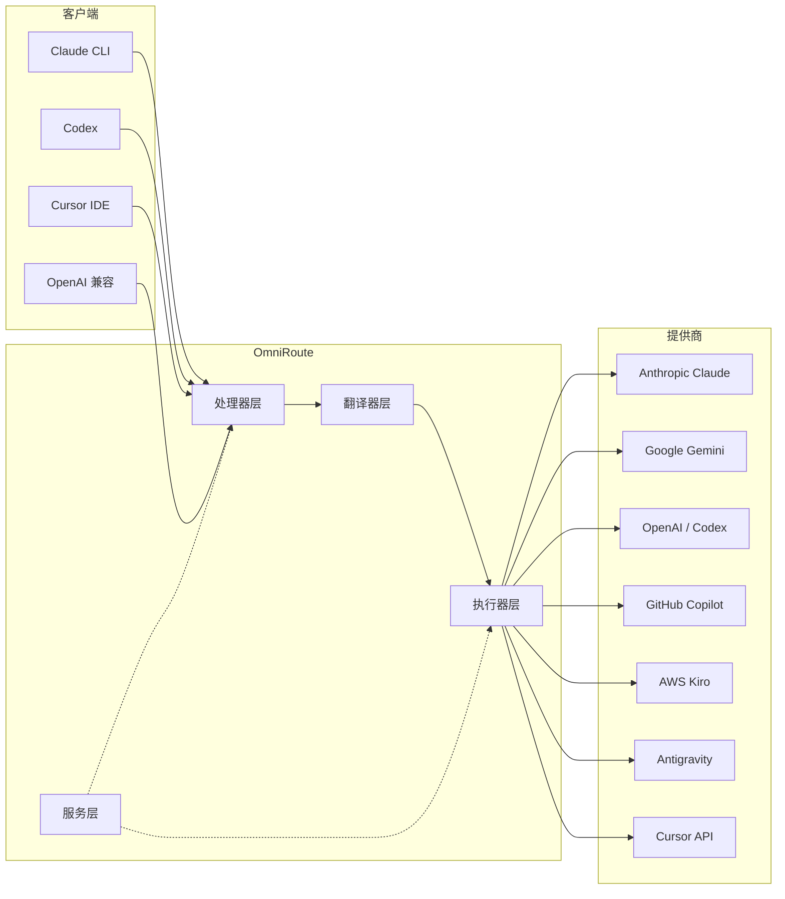

### 核心原则：中心辐射翻译

所有格式翻译都通过 **OpenAI 格式作为中心** 进行：

```
客户端格式 → [OpenAI 中心] → 提供商格式    （请求）
提供商格式 → [OpenAI 中心] → 客户端格式    （响应）
```

这意味着你只需要 **N 个翻译器**（每种格式一个）而不是 **N²**（每对格式一个）。

---

## 3. 项目结构

```
omniroute/
├── open-sse/                  ← 核心代理库（可移植，框架无关）
│   ├── index.js               ← 主入口点，导出所有内容
│   ├── config/                ← 配置和常量
│   ├── executors/             ← 提供商特定的请求执行
│   ├── handlers/              ← 请求处理编排
│   ├── services/              ← 业务逻辑（认证、模型、后备、用量）
│   ├── translator/            ← 格式翻译引擎
│   │   ├── request/           ← 请求翻译器（8 个文件）
│   │   ├── response/          ← 响应翻译器（7 个文件）
│   │   └── helpers/           ← 共享翻译工具（6 个文件）
│   └── utils/                 ← 工具函数
├── src/                       ← 应用层（Express/Worker 运行时）
│   ├── app/                   ← Web UI、API 路由、中间件
│   ├── lib/                   ← 数据库、认证和共享库代码
│   ├── mitm/                  ← 中间人代理工具
│   ├── models/                ← 数据库模型
│   ├── shared/                ← 共享工具（open-sse 的包装器）
│   ├── sse/                   ← SSE 端点处理器
│   └── store/                 ← 状态管理
├── data/                      ← 运行时数据（凭证、日志）
│   └── provider-credentials.json   （外部凭证覆盖，已 gitignore）
└── tester/                    ← 测试工具
```

---

## 4. 模块逐一分解

### 4.1 配置（`open-sse/config/`）

所有提供商配置的**单一事实来源**。

| 文件                          | 用途                                                                                                                                                                                  |
| ----------------------------- | ------------------------------------------------------------------------------------------------------------------------------------------------------------------------------------- |
| `constants.ts`                | `PROVIDERS` 对象，包含每个提供商的基础 URL、OAuth 凭证（默认值）、请求头和默认系统提示词。还定义了 `HTTP_STATUS`、`ERROR_TYPES`、`COOLDOWN_MS`、`BACKOFF_CONFIG` 和 `SKIP_PATTERNS`。 |
| `credentialLoader.ts`         | 从 `data/provider-credentials.json` 加载外部凭证，并合并覆盖 `PROVIDERS` 中的硬编码默认值。在保持向后兼容性的同时将密钥保持在源代码控制之外。                                         |
| `providerModels.ts`           | 中央模型注册表：将提供商别名映射到模型 ID。函数如 `getModels()`、`getProviderByAlias()`。                                                                                             |
| `codexInstructions.ts`        | 注入到 Codex 请求中的系统指令（编辑约束、沙箱规则、审批策略）。                                                                                                                       |
| `defaultThinkingSignature.ts` | Claude 和 Gemini 模型的默认"thinking"签名。                                                                                                                                           |
| `ollamaModels.ts`             | 本地 Ollama 模型的模式定义（名称、大小、家族、量化）。                                                                                                                                |

#### 凭证加载流程

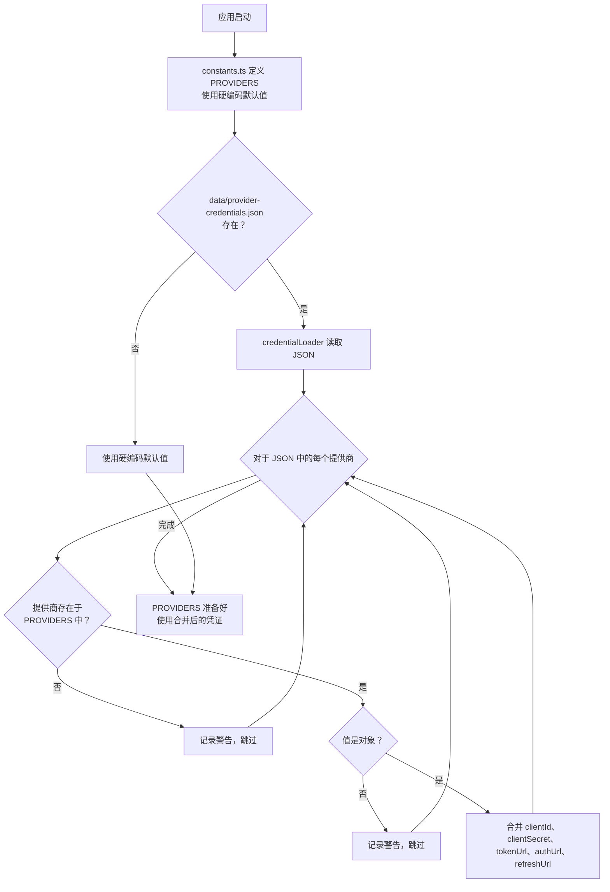

---

### 4.2 执行器（`open-sse/executors/`）

执行器使用**策略模式**封装**提供商特定逻辑**。每个执行器根据需要覆盖基类方法。

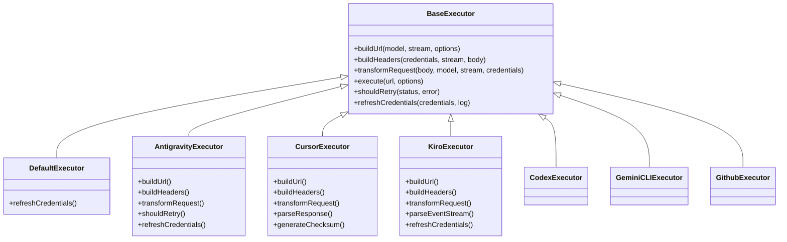

| 执行器           | 提供商                                     | 关键特性                                                                             |
| ---------------- | ------------------------------------------ | ------------------------------------------------------------------------------------ |
| `base.ts`        | —                                          | 抽象基类：URL 构建、请求头、重试逻辑、凭证刷新                                       |
| `default.ts`     | Claude、Gemini、OpenAI、GLM、Kimi、MiniMax | 标准提供商的通用 OAuth Token 刷新                                                    |
| `antigravity.ts` | Google Cloud Code                          | 项目/会话 ID 生成、多 URL 后备、从错误消息解析自定义重试（"reset after 2h7m23s"）    |
| `cursor.ts`      | Cursor IDE                                 | **最复杂**：SHA-256 校验和认证、Protobuf 请求编码、二进制 EventStream → SSE 响应解析 |
| `codex.ts`       | OpenAI Codex                               | 注入系统指令、管理 Thinking 级别、移除不支持的参数                                   |
| `gemini-cli.ts`  | Google Gemini CLI                          | 自定义 URL 构建（`streamGenerateContent`）、Google OAuth Token 刷新                  |
| `github.ts`      | GitHub Copilot                             | 双 Token 系统（GitHub OAuth + Copilot Token）、模拟 VSCode 请求头                    |
| `kiro.ts`        | AWS CodeWhisperer                          | AWS EventStream 二进制解析、AMZN 事件帧、Token 估算                                  |
| `index.ts`       | —                                          | 工厂：将提供商名称映射到执行器类，带默认后备                                         |

---

### 4.3 处理器（`open-sse/handlers/`）

**编排层** — 协调翻译、执行、流式传输和错误处理。

| 文件                  | 用途                                                                                                                                     |
| --------------------- | ---------------------------------------------------------------------------------------------------------------------------------------- |
| `chatCore.ts`         | **中央编排器**（约 600 行）。处理完整的请求生命周期：格式检测 → 翻译 → 执行器调度 → 流式/非流式响应 → Token 刷新 → 错误处理 → 用量日志。 |
| `responsesHandler.ts` | OpenAI Responses API 适配器：将 Responses 格式 → Chat Completions → 发送到 `chatCore` → 将 SSE 转换回 Responses 格式。                   |
| `embeddings.ts`       | Embedding 生成处理器：解析 Embedding 模型 → 提供商，调度到提供商 API，返回 OpenAI 兼容的 Embedding 响应。支持 6+ 个提供商。              |
| `imageGeneration.ts`  | 图像生成处理器：解析图像模型 → 提供商，支持 OpenAI 兼容、Gemini-image（Antigravity）和后备（Nebius）模式。返回 base64 或 URL 图像。      |

#### 请求生命周期（chatCore.ts）

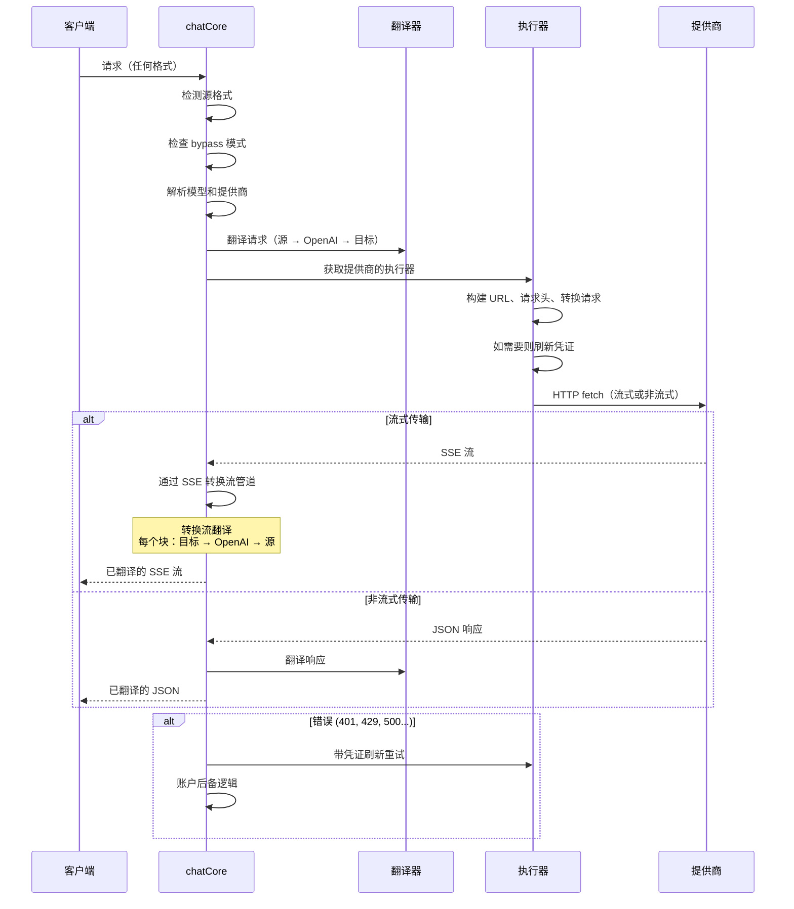

---

### 4.4 服务（`open-sse/services/`）

支持处理器和执行器的业务逻辑。

| 文件                 | 用途                                                                                                                                                                                                                                                             |
| -------------------- | ---------------------------------------------------------------------------------------------------------------------------------------------------------------------------------------------------------------------------------------------------------------- |
| `provider.ts`        | **格式检测**（`detectFormat`）：分析请求体结构以识别 Claude/OpenAI/Gemini/Antigravity/Responses 格式（包括 Claude 的 `max_tokens` 启发式）。还有：URL 构建、请求头构建、Thinking 配置规范化。支持 `openai-compatible-*` 和 `anthropic-compatible-*` 动态提供商。 |
| `model.ts`           | 模型字符串解析（`claude/model-name` → `{provider: "claude", model: "model-name"}`）、带冲突检测的别名解析、输入清理（拒绝路径遍历/控制字符）、以及支持异步别名获取器的模型信息解析。                                                                             |
| `accountFallback.ts` | 速率限制处理：指数退避（1s → 2s → 4s → 最大 2 分钟）、账户冷却管理、错误分类（哪些错误触发后备，哪些不触发）。                                                                                                                                                   |
| `tokenRefresh.ts`    | **每个提供商**的 OAuth Token 刷新：Google（Gemini、Antigravity）、Claude、Codex、Qwen、Qoder、GitHub（OAuth + Copilot 双 Token）、Kiro（AWS SSO OIDC + 社交认证）。包括进行中 Promise 去重缓存和指数退避重试。                                                   |
| `combo.ts`           | **Combo 模型**：后备模型链。如果模型 A 因可后备错误失败，尝试模型 B，然后 C，依此类推。返回实际的上游状态码。                                                                                                                                                    |
| `usage.ts`           | 从提供商 API 获取配额/用量数据（GitHub Copilot 配额、Antigravity 模型配额、Codex 速率限制、Kiro 用量明细、Claude 设置）。                                                                                                                                        |
| `accountSelector.ts` | 智能账户选择与评分算法：考虑优先级、健康状态、轮询位置和冷却状态，为每个请求选择最优账户。                                                                                                                                                                       |
| `contextManager.ts`  | 请求上下文生命周期管理：创建和追踪带有元数据（请求 ID、时间戳、提供商信息）的每请求上下文对象，用于调试和日志。                                                                                                                                                  |
| `ipFilter.ts`        | 基于 IP 的访问控制：支持白名单和黑名单模式。在处理 API 请求前根据配置规则验证客户端 IP。                                                                                                                                                                         |
| `sessionManager.ts`  | 带客户端指纹的会话追踪：使用哈希客户端标识符追踪活动会话、监控请求计数、提供会话指标。                                                                                                                                                                           |
| `signatureCache.ts`  | 基于请求签名的去重缓存：通过缓存近期请求签名并在时间窗口内为相同请求返回缓存响应来防止重复请求。                                                                                                                                                                 |
| `systemPrompt.ts`    | 全局系统提示词注入：在所有请求前置或追加可配置的系统提示词，带每提供商兼容性处理。                                                                                                                                                                               |
| `thinkingBudget.ts`  | 推理 Token 预算管理：支持 passthrough（透传）、auto（剥离 Thinking 配置）、custom（固定预算）和 adaptive（复杂度缩放）模式来控制 Thinking/推理 Token。                                                                                                           |
| `wildcardRouter.ts`  | 通配符模型模式路由：根据可用性和优先级将通配符模式（如 `*/claude-*`）解析为具体的提供商/模型对。                                                                                                                                                                 |

#### Token 刷新去重

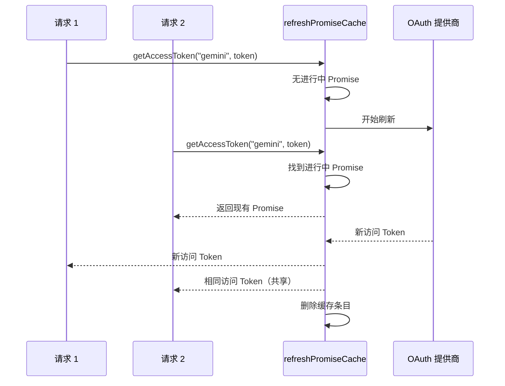

#### 账户后备状态机

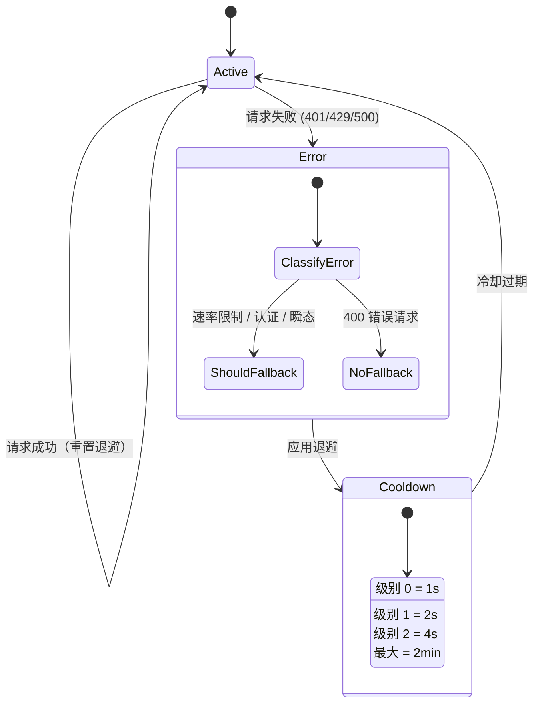

#### Combo 模型链

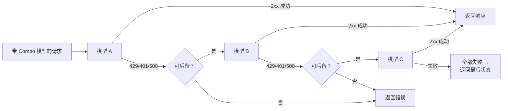

---

### 4.5 翻译器（`open-sse/translator/`）

使用自注册插件系统的**格式翻译引擎**。

#### 架构

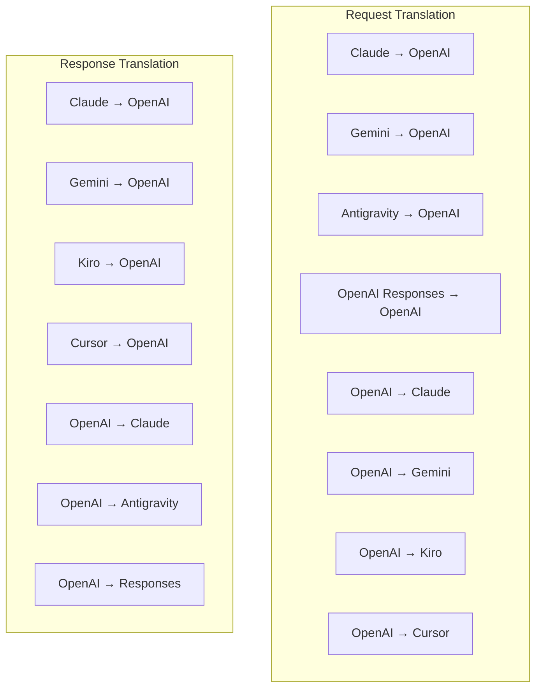

| 目录         | 文件数       | 描述                                                                                                                                                                                                               |
| ------------ | ------------ | ------------------------------------------------------------------------------------------------------------------------------------------------------------------------------------------------------------------ |
| `request/`   | 8 个翻译器   | 在不同格式之间转换请求体。每个文件在导入时通过 `register(from, to, fn)` 自注册。                                                                                                                                   |
| `response/`  | 7 个翻译器   | 在不同格式之间转换流式响应块。处理 SSE 事件类型、thinking 块、工具调用。                                                                                                                                           |
| `helpers/`   | 6 个辅助工具 | 共享工具：`claudeHelper`（系统提示词提取、thinking 配置）、`geminiHelper`（parts/contents 映射）、`openaiHelper`（格式过滤）、`toolCallHelper`（ID 生成、缺失响应注入）、`maxTokensHelper`、`responsesApiHelper`。 |
| `index.ts`   | —            | 翻译引擎：`translateRequest()`、`translateResponse()`、状态管理、注册表。                                                                                                                                          |
| `formats.ts` | —            | 格式常量：`OPENAI`、`CLAUDE`、`GEMINI`、`ANTIGRAVITY`、`KIRO`、`CURSOR`、`OPENAI_RESPONSES`。                                                                                                                      |

#### 关键设计：自注册插件

```javascript
// 每个翻译器文件在导入时调用 register()：
import { register } from "../index.js";
register("claude", "openai", translateClaudeToOpenAI);

// index.js 导入所有翻译器文件，触发注册：
import "./request/claude-to-openai.js"; // ← 自注册
```

---

### 4.6 工具 (`open-sse/utils/`)

| 文件               | 用途                                                                                                                                                                                         |
| ------------------ | -------------------------------------------------------------------------------------------------------------------------------------------------------------------------------------------- |
| `error.ts`         | 错误响应构建（OpenAI 兼容格式）、上游错误解析、从错误消息中提取 Antigravity 重试时间、SSE 错误流式传输。                                                                                     |
| `stream.ts`        | **SSE 转换流** — 核心流式管道。两种模式：`TRANSLATE`（完整格式转换）和 `PASSTHROUGH`（规范化 + 提取用量）。处理块缓冲、用量估算、内容长度追踪。每流独立的 encoder/decoder 实例避免共享状态。 |
| `streamHelpers.ts` | 底层 SSE 工具：`parseSSELine`（容忍空白）、`hasValuableContent`（过滤 OpenAI/Claude/Gemini 的空块）、`fixInvalidId`、`formatSSE`（感知格式的 SSE 序列化，清理 `perf_metrics`）。             |
| `usageTracking.ts` | 从任何格式提取 Token 用量（Claude/OpenAI/Gemini/Responses），使用独立的工具/消息字符-token 比率估算，添加缓冲（2000 token 安全边际），格式特定字段过滤，带 ANSI 颜色的控制台日志。           |
| `requestLogger.ts` | 基于文件的请求日志（通过 `ENABLE_REQUEST_LOGS=true` 启用）。创建带编号文件的会话文件夹：`1_req_client.json` → `7_res_client.txt`。所有 I/O 异步（fire-and-forget）。遮蔽敏感请求头。         |
| `bypassHandler.ts` | 拦截 Claude CLI 的特定模式（标题提取、预热、计数）并返回假响应而不调用任何提供商。支持流式和非流式。有意限制在 Claude CLI 范围内。                                                           |
| `networkProxy.ts`  | 为给定提供商解析出站代理 URL，优先级：提供商特定配置 → 全局配置 → 环境变量（`HTTPS_PROXY`/`HTTP_PROXY`/`ALL_PROXY`）。支持 `NO_PROXY` 排除。配置缓存 30 秒。                                 |

#### SSE 流管道

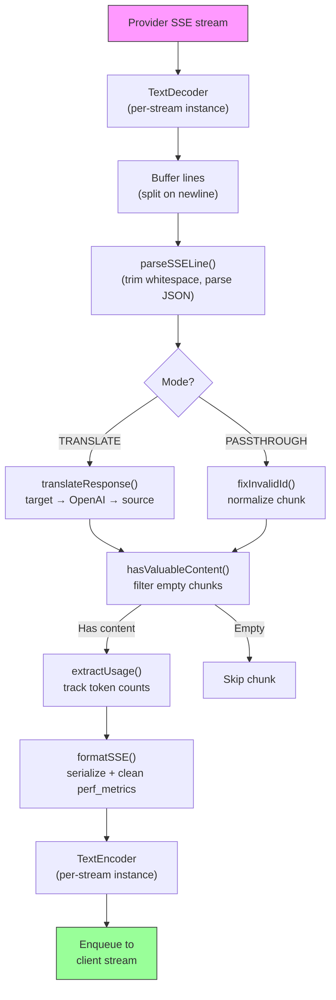

#### 请求日志器会话结构

```
logs/
└── claude_gemini_claude-sonnet_20260208_143045/
    ├── 1_req_client.json      ← 原始客户端请求
    ├── 2_req_source.json      ← 初始转换后
    ├── 3_req_openai.json      ← OpenAI 中间格式
    ├── 4_req_target.json      ← 最终目标格式
    ├── 5_res_provider.txt     ← 提供商 SSE 块（流式）
    ├── 5_res_provider.json    ← 提供商响应（非流式）
    ├── 6_res_openai.txt       ← OpenAI 中间块
    ├── 7_res_client.txt       ← 面向客户端的 SSE 块
    └── 6_error.json           ← 错误详情（如有）
```

---

### 4.7 应用层（`src/`）

| 目录          | 用途                                                 |
| ------------- | ---------------------------------------------------- |
| `src/app/`    | Web UI、API 路由、Express 中间件、OAuth 回调处理器   |
| `src/lib/`    | 数据库访问（`localDb.ts`、`usageDb.ts`）、认证、共享 |
| `src/mitm/`   | 用于拦截提供商流量的中间人代理工具                   |
| `src/models/` | 数据库模型定义                                       |
| `src/shared/` | open-sse 函数的包装器（provider、stream、error 等）  |
| `src/sse/`    | 将 open-sse 库连接到 Express 路由的 SSE 端点处理器   |
| `src/store/`  | 应用状态管理                                         |

#### 重要 API 路由

| 路由                                          | 方法            | 用途                                                              |
| --------------------------------------------- | --------------- | ----------------------------------------------------------------- |
| `/api/provider-models`                        | GET/POST/DELETE | 每提供商自定义模型的 CRUD                                         |
| `/api/models/catalog`                         | GET             | 按提供商分组的所有模型（聊天、Embedding、图像、自定义）的聚合目录 |
| `/api/settings/proxy`                         | GET/PUT/DELETE  | 分层出站代理配置（`global/providers/combos/keys`）                |
| `/api/settings/proxy/test`                    | POST            | 验证代理连接并返回公共 IP/延迟                                    |
| `/v1/providers/[provider]/chat/completions`   | POST            | 带模型验证的专用每提供商聊天完成                                  |
| `/v1/providers/[provider]/embeddings`         | POST            | 带模型验证的专用每提供商 Embedding                                |
| `/v1/providers/[provider]/images/generations` | POST            | 带模型验证的专用每提供商图像生成                                  |
| `/api/settings/ip-filter`                     | GET/PUT         | IP 白名单/黑名单管理                                              |
| `/api/settings/thinking-budget`               | GET/PUT         | 推理 Token 预算配置（passthrough/auto/custom/adaptive）           |
| `/api/settings/system-prompt`                 | GET/PUT         | 所有请求的全局系统提示词注入                                      |
| `/api/sessions`                               | GET             | 活动会话追踪和指标                                                |
| `/api/rate-limits`                            | GET             | 每账户速率限制状态                                                |

---

## 5. 关键设计模式

### 5.1 中心辐射翻译

所有格式都通过 **OpenAI 格式作为中心** 进行翻译。添加新提供商只需要编写**一对**翻译器（到/从 OpenAI），而不是 N 对。

### 5.2 执行器策略模式

每个提供商都有一个继承自 `BaseExecutor` 的专用执行器类。`executors/index.ts` 中的工厂在运行时选择正确的执行器。

### 5.3 自注册插件系统

翻译器模块在导入时通过 `register()` 自注册。添加新翻译器只需创建文件并导入它。

### 5.4 带指数退避的账户后备

当提供商返回 429/401/500 时，系统可以切换到下一个账户，应用指数冷却（1s → 2s → 4s → 最大 2min）。

### 5.5 Combo 模型链

"Combo"组合多个 `provider/model` 字符串。如果第一个失败，自动后备到下一个。

### 5.6 有状态流式翻译

响应翻译通过 `initState()` 机制在 SSE 块之间维护状态（Thinking 块追踪、工具调用累积、内容块索引）。

### 5.7 用量安全缓冲

在报告的用量中添加 2000 Token 缓冲，以防止客户端因系统提示词和格式翻译开销而达到上下文窗口限制。

---

## 6. 支持的格式

| 格式                    | 方向      | 标识符             |
| ----------------------- | --------- | ------------------ |
| OpenAI Chat Completions | 源 + 目标 | `openai`           |
| OpenAI Responses API    | 源 + 目标 | `openai-responses` |
| Anthropic Claude        | 源 + 目标 | `claude`           |
| Google Gemini           | 源 + 目标 | `gemini`           |
| Google Gemini CLI       | 仅目标    | `gemini-cli`       |
| Antigravity             | 源 + 目标 | `antigravity`      |
| AWS Kiro                | 仅目标    | `kiro`             |
| Cursor                  | 仅目标    | `cursor`           |

---

## 7. 支持的提供商

| 提供商                   | 认证方法                | 执行器      | 关键说明                          |
| ------------------------ | ----------------------- | ----------- | --------------------------------- |
| Anthropic Claude         | API 密钥或 OAuth        | Default     | 使用 `x-api-key` 请求头           |
| Google Gemini            | API 密钥或 OAuth        | Default     | 使用 `x-goog-api-key` 请求头      |
| Google Gemini CLI        | OAuth                   | GeminiCLI   | 使用 `streamGenerateContent` 端点 |
| Antigravity              | OAuth                   | Antigravity | 多 URL 后备，自定义重试解析       |
| OpenAI                   | API 密钥                | Default     | 标准 Bearer 认证                  |
| Codex                    | OAuth                   | Codex       | 注入系统指令，管理 Thinking       |
| GitHub Copilot           | OAuth + Copilot Token   | Github      | 双 Token，模拟 VSCode 请求头      |
| Kiro (AWS)               | AWS SSO OIDC 或社交     | Kiro        | 二进制 EventStream 解析           |
| Cursor IDE               | 校验和认证              | Cursor      | Protobuf 编码，SHA-256 校验和     |
| Qwen                     | OAuth                   | Default     | 标准认证                          |
| Qoder                    | OAuth（Basic + Bearer） | Default     | 双认证请求头                      |
| OpenRouter               | API 密钥                | Default     | 标准 Bearer 认证                  |
| GLM、Kimi、MiniMax       | API 密钥                | Default     | Claude 兼容，使用 `x-api-key`     |
| `openai-compatible-*`    | API 密钥                | Default     | 动态：任何 OpenAI 兼容端点        |
| `anthropic-compatible-*` | API 密钥                | Default     | 动态：任何 Claude 兼容端点        |

---

## 8. 数据流摘要

### 流式请求

```mermaid
flowchart LR
    A["客户端"] --> B["detectFormat()"]
    B --> C["translateRequest()\n源 → OpenAI → 目标"]
    C --> D["执行器\nbuildUrl + buildHeaders"]
    D --> E["fetch(providerURL)"]
    E --> F["createSSEStream()\nTRANSLATE 模式"]
    F --> G["parseSSELine()"]
    G --> H["translateResponse()\n目标 → OpenAI → 源"]
    H --> I["extractUsage()\n+ addBuffer"]
    I --> J["formatSSE()"]
    J --> K["客户端接收\n已翻译的 SSE"]
    K --> L["logUsage()\nsaveRequestUsage()"]
```

### 非流式请求

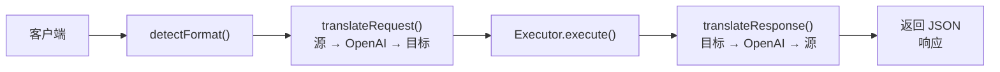

### Bypass 流程（Claude CLI）

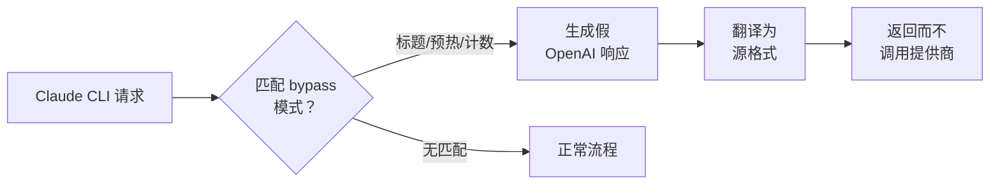
